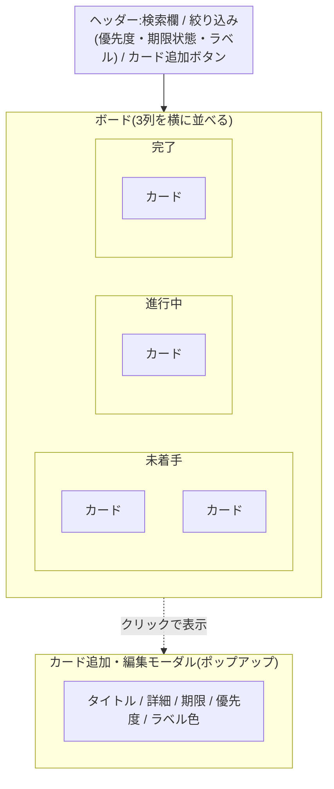
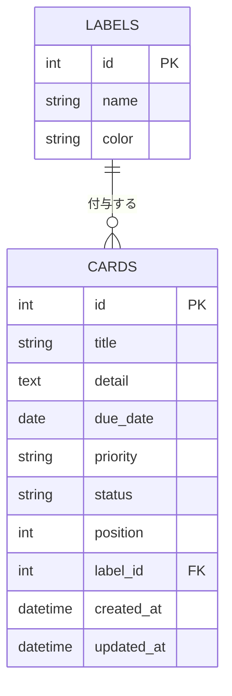

# 基本設計書:タスク管理ボード(仮)

要件定義は [requirements.md](requirements.md) を参照。本書では、要件を実現するための画面構成とデータ設計を定義する。

## 1. 画面構成

- 画面は1枚(ボード画面)。
- 「未着手 / 進行中 / 完了」の3列を横に並べる。
- カードの追加・編集はモーダル(ポップアップ)で行う。
- 検索欄・絞り込みはボード上部に置く。

### 1.1 ワイヤーフレーム

## 2. データ項目(カード)

| 項目 | 内容 | 入力 |
|---|---|---|
| タイトル | 文字列 | 必須 |
| 詳細 | 文字列(複数行) | 任意 |
| 期限 | 日付 | 任意 |
| 優先度 | 高 / 中 / 低(初期値は「中」)。色や印で表示する | 必須 |
| ラベル色 | 色の選択肢(F-07 実装時) | 任意 |
| 状態(列) | 未着手 / 進行中 / 完了 | 自動 |
| 並び順 | 列内での表示順(ドラッグ&ドロップで変更) | 自動 |

### 2.1 ER図

ラベル色(F-07)を独立したマスタとして切り出し、カードから参照する構成とする。

- CARDS.status は「未着手 / 進行中 / 完了」を表す(列の追加はしないため固定値とし、別テーブルには分けない)。
- 利用者は自分ひとりのためユーザーテーブルは持たない。
